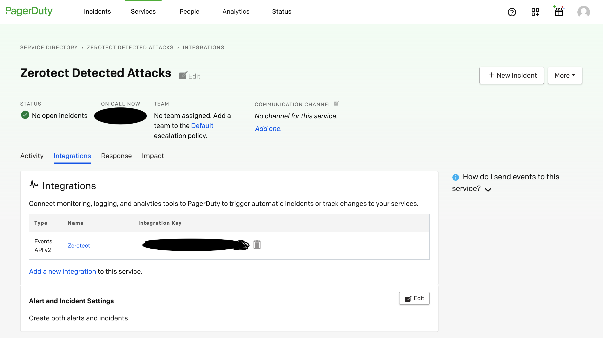

# PagerDuty Integration

## PagerDuty + Zerotect Integration Benefits

* Detect memory-based attacks in progress

## How it Works

Zerotect looks for faults (such as segmentation fault, protection fault, etc.) in the [kernel log buffer](https://www.kernel.org/doc/html/latest/core-api/printk-basics.html) and analyzes them in real-time to detect memory-based attacks in progress. When an attack is detected, an Event is raised in PagerDuty.

## Requirements

* PagerDuty integrations require an Admin base role for account authorization. If you do not have this role, please reach out to an Admin or Account Owner within your organization to configure the integration.
* Zerotect requires an integration key. Integration keys are generated by creating a new service or by creating a new integration for an existing service.

## Support

If you need help with this integration, please contact support@polyverse.com.

## Integration Walkthrough

### In PagerDuty

#### Integrating With a PagerDuty Service

1. From the **Configuration** menu, select **Services**.
2. There are two ways to add an integration to a service:
   * **If you are adding your integration to an existing service**: Click the **name** of the service you want to add the integration to. Then, select the **Integrations** tab and click the **New Integration** button.
   * **If you are creating a new service for your integration**: Please read our documentation in section [Configuring Services and Integrations](https://support.pagerduty.com/docs/services-and-integrations#section-configuring-services-and-integrations) and follow the steps outlined in the [Create a New Service](https://support.pagerduty.com/docs/services-and-integrations#section-create-a-new-service) section, selecting **Zerotect** as the **Integration Type** in step 4. Continue with the In  **Zerotect**  section (below) once you have finished these steps.
3. Enter an **Integration Name** in the format `monitoring-tool-service-name` (e.g.  **Zerotect**-Attack-Detections) and select  **Zerotect**  from the Integration Type menu.
4. Click the **Add Integration** button to save your new integration. You will be redirected to the Integrations tab for your service.
5. An **Integration Key** will be generated on this screen. Keep this key saved in a safe place, as it will be used when you configure the integration with  **Zerotect**  in the next section.


### In **ZeroTect**

1. Install Zerotect on any host with the following command:

```.bash
curl -s -L https://github.com/polyverse/zerotect/releases/latest/download/install.sh | sh -s -- --pagerduty <integration key>
```

#### How to Uninstall

1. Uninstall Zerotect by running this command:

```.bash
curl -s -L https://github.com/polyverse/zerotect/releases/latest/download/install.sh | sh -s -- --uninstall
```
